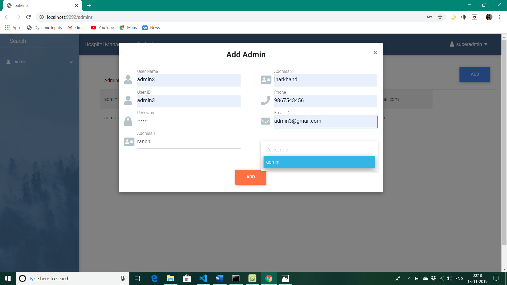

# HOSPITAL MANAGEMENT PROJECT
> This is a software to computerize the Front Office Management of Hospital. This software  is user friendly simple, fast, and cost – effective. Made using NodeJS, AngularJs and MongoDB.

## Table of contents
* [General info](#general-info)
* [Screenshots](#screenshots)
* [Technologies](#technologies)
* [Setup](#setup)
* [Features](#features)
* [Status](#status)
* [Inspiration](#inspiration)
* [Contact](#contact)

## General info
This app contains different modules for admin, operators, doctors and patients. Each user is assigned login credentials by respective user and their session id is stored. The operator can schedule the appointments of every doctor based on their available time slots and individual doctors can view their own appointments. The doctors can also update the health details of the patients which can be checked by the respective patient. 

## Screenshots

## Technologies
* Software to be installed - NodeJS, MongoDB, NoSQL Booster
* Database Used - MongoDB
* Front-end  - HTML, CSS, JavaScript, BootStrap, AngularJS
* Back-end  - Node JS

## Setup
1. Install the latest version of the required softwares.
2. Download the zip file, or clone the project from git repository.
3. Open command prompt in the project directory and install all dependencies and run the application.
4. In mongoDB, database named 'hospitals' is already made after running the application. Now in user collection, add the details of the superadmin (using NOSQL booster)to login to the project for 1st time.
5. Open localhost : 9092 to access the software application and login using the given id and password.

## Code Examples
To install all the dependencies:
`npm install`
&nbsp;
To run the application:
`npm run server.js`
&nbsp;
insert this record in the user collection.
`{ "id": "superadmin",`
    `"password": "superadmin",`
    `"role": "superadmin"`
`}`

 

## Features
List of features ready: 
* Administrator can add the records of both doctors and receptionists and assign them with login id and password. He can also, update or delete their records(if neccessary).
* Any receptionist of the hospital can register a patient on this application and make his appointment with the doctor which is available on the required date and time. 
* Every doctor can login in the software and can see all his upcoming appointments which are made by the receptionist. The doctor can view only his appointment and not the appointments of the other doctors.
* Similarly, each individual patient can also keep track of his upcoming appointment. 
* Doctor can fill in all the diagonosis details of the patient on this app which can be viewed later only by the respective patient by logging in. The doctor can also update this detail, after another checkup few months later.
* Whenever a login id is created for a person, he will automatically get an email mentioning his userid and password so that he can keep this for further use. 

To-do list:
* To extend this application  as a central software for administration of many hospitals at a time.
* To automatically delete the previous appointments or categorize them under archive section. 
* To restrict the health details to be updated only after the appointment date and only by the respective doctor.
* Payroll system can also be added in the project for all the employees of the hospital  

## Status
Project is: _running_ but more features can be added later, which are mentioned in To-do-list.

## Inspiration
Reference taken from [w3schools.com](https://www.w3schools.com/), [mdBootstrap](https://mdbootstrap.com/), 
[Express](https://expressjs.com/en/api.html), [MongoDB](https://docs.mongodb.com/) 

## Contact
Created by [@swati_jha](https://linkedin.com/in/swati-jha-97586714b) - feel free to contact me!